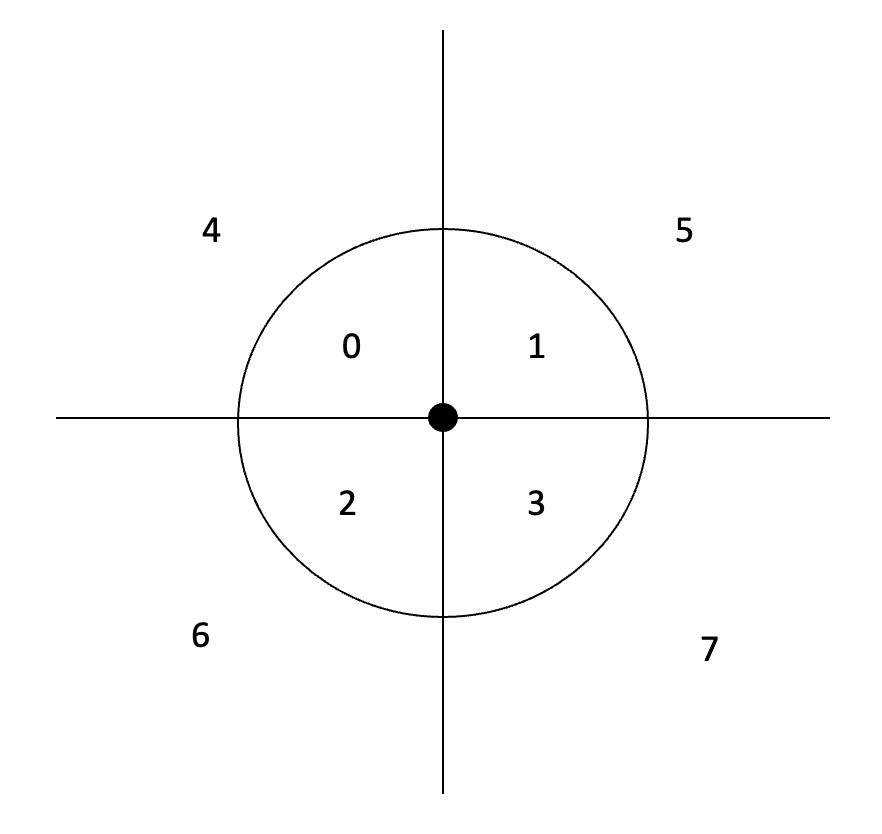

# Predicate Invention

##### considering about search space

### Invent by Clustering

cluster several predicates as a new concept, e.g.
  
```
Inv_1(A,B) :- p_1(A,B)
Inv_1(A,B) :- p_2(A,B)
Inv_1(A,B) :- p_3(A,B)
```

- Chain Invention
``` 
Inv_1(A,B) :- p(A,C), p(C,B)
Inv_2(A,B) :- p_1(A,C), p_2(C,B) 
```

## Introduce Position Perception System

### Problem 01:  Expand Language

We need to extend our language 
so that the spatial positions can be represented more accurate. 
Let's consider in 2D space. The whole space can be divided into 8 areas.  



Then, the spatial relationship between any two objects can be classified by this 8-area map.
We can consider one object as the reference, whose position at the center. 
The area of the other object locating at can be decided by this 8-area map. 

We can use a neural predicate to predict the area that the other object locating at.
```
neural_preds:
    area:3:object,object,area
```

```
preds:
    at_area_0:2:object, object
    at_area_1:2:object, object
    at_area_2:2:object, object
    at_area_3:2:object, object
    at_area_4:2:object, object
    at_area_5:2:object, object
    at_area_6:2:object, object
    at_area_7:2:object, object
```

```
consts:
    area:a0,a1,a2,a3,a4,a5,a6,a7
```

```
bk:
    area_0(a0).
    area_1(a1).
    area_2(a2).
    area_3(a3).
    area_4(a4).
    area_5(a5).
    area_6(a6).
    area_7(a7).
```

```
bk_clauses:
    at_area_0(X,Y):-area(X,Y,Z), area_0(Z)
    at_area_1(X,Y):-area(X,Y,Z), area_1(Z)
    at_area_2(X,Y):-area(X,Y,Z), area_2(Z) 
    at_area_3(X,Y):-area(X,Y,Z), area_3(Z) 
    at_area_4(X,Y):-area(X,Y,Z), area_4(Z) 
    at_area_5(X,Y):-area(X,Y,Z), area_5(Z) 
    at_area_6(X,Y):-area(X,Y,Z), area_6(Z) 
    at_area_7(X,Y):-area(X,Y,Z), area_7(Z) 
```

### Problem 02: learning relationship "Nearby"
when the model see the positive `nearby` images, 
they will come up with predicate 
`at_area_0`, `at_area_1`, `at_area_2`, `at_area_3`, 
but none of these predicates holds in all the positive images.

Now, we can use our own brain to invent a predicate to cover these four cases

```
inv_1(X,Y) :- at_area_0(X,Y)
inv_1(X,Y) :- at_area_1(X,Y)
inv_1(X,Y) :- at_area_2(X,Y)
inv_1(X,Y) :- at_area_3(X,Y)
```

The new predicate `inv_1(X,Y)` is invented, which has the same meaning as `nearby(X,Y)`.

Similarly, we can invent predicate `faraway`, if two objects have a big distance.

``` 
inv_2(X,Y) :- at_area_4(X,Y)
inv_2(X,Y) :- at_area_5(X,Y)
inv_2(X,Y) :- at_area_6(X,Y)
inv_2(X,Y) :- at_area_7(X,Y)
```

Now, the new predicates seems can be clustered.


###### When should we invent a new predicate

I

###### How should we invent a new predicate


### Problem 03: learning relationship "Online"


## Introduce Counting system

---

### Problem 01: Group-X-Y

Given X and Y as two positive integers, we can generate a set of images following the rules: 
- Each image has X groups of objects which distinguish with some kind of property 
(like color, shape, etc). 
- Each group has exactly Y objects.

### Idea

Let's start from X=2, Y=3, i.e. 2 groups, 3 objects in each group:

We need a counter to count the number of objects.
Introduce new neural predicate:
```
one(A, B, p) // from position A to B, there is one object with property p
zero(A, B, p) // from position A to B, there is no object with property p
```
these two predicates are supposed as neural predicate, 
thus the perception model should be able to provide a confidence to each predicate.

Then, the Predicate Invention **(PI)** model is supposed to do the following jobs to count 1st group
```
inv_1(A, B, p1) :- one(A, C, p1), one(C, B, p1) 
inv_2(A, B, p1) :- inv_1(A, C, p1), one(C, B, p1)
```
where `inv_1` and  `inv_2` are invented predicates. 
`ìnv_1` means from A to B there are 2 objects with property `p1`.
`ìnv_2` means from A to B there are 3 objects with property `p1`.
Until here, the PI already give the ability to count to 3 objects in one group. 
For a positive image, the argument A should be the first pixel/search_grid of the image, 
the argument B should be the last pixel/search_grid. 
Then, we can say, the image has exact 3 objects with this property.

For the case of 2nd group, the clause should be found as follows
```
inv_1(A, B, p2) :- one(A, C, p2), one(C, B, p2)
inv_2(A, B, p2) :- inv_1(A, C, p2), one(C, B, p2)
 ```
in this case, no new predicate is invented when count the group with property `p2`, which is an ideal situation 
so the invented predicates `inv_1, inv_2` can be reused.

So far, the useful conclusions are `inv_2(A, B, p1)` and `inv_2(A, B, p2)`, 
which count groups with property `p1` and `p2` to 3, respectively. 

At last, one more predicate is required `diff_prop(p1, p2)`, 
which can be designed as background knowledge. So the final clause can be 
``` 
positive(img) :- inv_2(A, B, p1), inv_2(A, B, p2), diff_prop(p1, p2)
```

##### Discussion

In this example, two new predicates have been invented, `inv_1(A,B,p)` and `inv_2(A,B,p)`,
which count the object with property `p` to 2 and 3, respectively. 
Where `A` and `B` in the predicates denote for the positions in the images. 

1. `zero(A,B,p)`: It is not always the case that `B` are the same. So we have to use some clause to extend B  to the last pixel/search_grid, 
so that we can guarantee there are always two counters corresponding the whole images. 
We can use a `zero(A,B,p)` predicate do the trick 
```
inv_2(A, B, p) :- inv_2(A, C, p), zero(C, B, p) 
```
2. `one(A,B,p)`: By adding this predicate, the ILP system is supposed to count any number of objects from position
`A` to `B` with the same property `p`, which can use the clause
```
inv_1(A,B,p) :- one(A,C,p), one(C,D,p), ..., one(X,B,p)
```
where `inv_1(A,B,p)` is an invented predicate.


### TODO List
- Generate positive and negative images.
- 